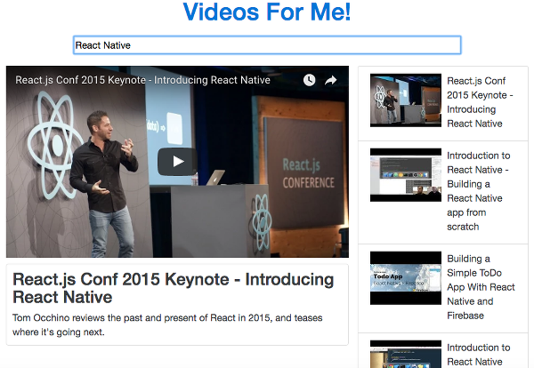

# Videos For Me

Quickly search for videos on YouTube



## Installation

Create a `.env` file in the root directory and define the YouTube API key:

```
YOUTUBE_API_KEY=VALUE_GOES_HERE
```

Run npm to install all the dependencies

```
npm install
```

## Development

Run the webpack development server using

```
npm start
```

The app will be available at <http://localhost:8080>

## Build

Run the following command to build files to the `build/` directory:

```sh
npm run build
```
